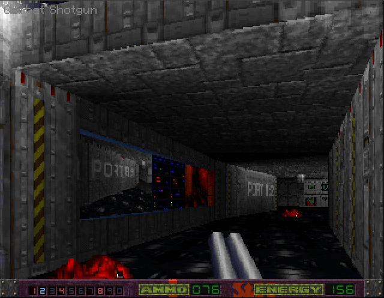

# Karlos TKG: Alien Breed 3D II Redux

This is a continuation of a mod, that I first started in around 1997, for Alien Breed 3D 2 - The Killing Grounds. This game was originally released for Commodore Amiga 1200 and 4000 in 1996, to mixed reviews. The positive reviews tended to praise the technical accomplishments; fullscreen 1x1, large textures, dynamic lighting, bump maps and 3D models. The negative reviews largely criticised the performance and generally unfinished feel of the game. You really needed at least a 68040 to play it, at 2/3 display size and after a few levels, the visuals became relentlessly repetitive, reusing the same few textures. There were still some excellent levels but the game did not play as well as the first Alien Breed 3D.

The current version of the mod is a work-in-progress and attempts to address the shortcomings of the original game:

- Ships with the improved engine from https://github.com/mheyer32/alienbreed3d2
    - Better performance
    - Support for RTG
    - Fixes numerous bugs that affect gameplay and design, e.g. floor damage when not in contact, inability to texture hidden doors correctly, fixed music module size, etc.
    - Adds new features specifically to support mods, e.g. per-level floor and wall texture overrides, inventory limits etc.
- Levels built using the improved LevelEd from https://github.com/AndyLoft/AB3D2_LevelED which has had numerous bug fixes and enhancements including many requested specifically for this project.

## Improvements
- Significantly expanded texture sets for greater overall variation.
- Per level texture overrides to help set the theme.
- Improved lighting variation including faux coloured lighting.
- New enemies.
- New sounds.
- Vector pickups (weapons, ammo, health)
- New weapons.
- Inventory limits.

## How to use this
In order to use this, you'll need to check the repository out into a location that's accessible from a real Amiga (or UAE) if you want to actually run the mod or edit any of it. You can also use the Download as Zip feature from the home page.

To run the game, go into the Game drawer on your Amiga and double-click the KarlosTKG icon.
- If you experience problems with the launch script after using git to pull the repo, check that there are no automatic line ending conversion configured in your client.

### Engine Selection
On opening the KarlosTKG icon, the startup script will ask you to select an engine to use:

- ASM: This version is implememented in 100% assembler and has no support graphics cards. 
- ASM Dev: As above, but includes devmode features used in level editing and engine debugging.
- RTG: This version is implemented in assembler with some C and has support for graphics cards. In RTG mode, OCS and ECS machines are supported.
- RTG Dev: As above, but includes devmode features used in level editing and engine debugging.

### Quality Selection

- High Spec: This version is intended for high end systems. A fast 060 is recommeded as a miminum. PiStorm users can expect 50fps with CM4.
- Low Spec: This version is recommended for machines up to 68060. Uses fewer vector models and decoration objects and may have reduced geometric complexity for some levels.

## Editing
The mod ships with the original editing tools and all assets in iff/png format. Sound assets are either raw or 8svx.

## Comparative Screenshots

Shown below are some comparative screenshots.

### Medical bay and quarantine

This is where you start. In the original Team17 release, you have the shotgun. In this version, you begin with the blaster and have to locate the shotgun.

### Bridge and Ready Room

In the original release, locating the Bridge is pretty straightfowards. In this version, the whole ship is in lockdown, with intersection doors closed. You'll have to find a different route there.

### Docking Ring

In the original release, it's not made exactly clear what the Indomitable is docked with, other than the suggestion it's part of the alien titan. In this release, the ship is docked with a human built orbital facility. You aren't the only thing docked, however...

# Plot Reboot
Coming soon....
